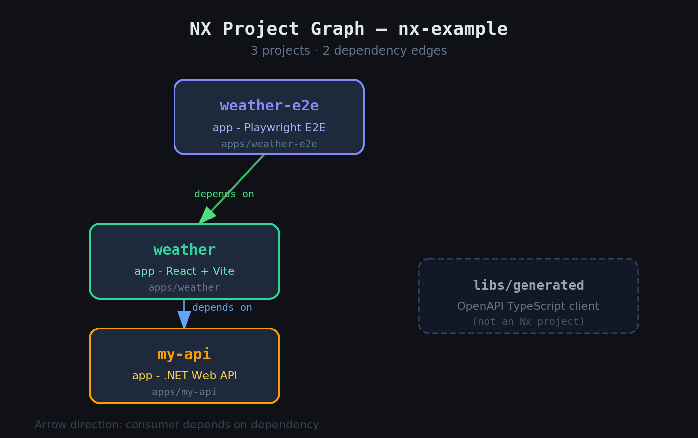

# nx-example

> A full-stack monorepo built with [Nx](https://nx.dev) — React weather frontend + .NET backend API, wired together with OpenAPI code generation.

[](https://github.com/pettersandvand/nx-example/actions)
[](https://nodejs.org)
[](https://dotnet.microsoft.com)
[](https://nx.dev)

---

## 📦 What's in this repo

| Project | Type | Stack | Description |
|---|---|---|---|
| `apps/weather` | App | React 19 · Vite · Tailwind CSS | Weather frontend |
| `apps/weather-e2e` | E2E tests | Playwright | End-to-end tests for the weather app |
| `apps/my-api` | App | .NET 8 (C#) | Backend REST API |
| `apps/my-api-test` | Tests | .NET 8 | API integration tests |
| `libs/generated` | Library | TypeScript | Auto-generated OpenAPI client |

### Dependency graph



> Run `pnpm nx graph` to open the interactive version in your browser.

---

## 🛠 Prerequisites

| Tool | Version |
|---|---|
| [Node.js](https://nodejs.org/) | v20+ |
| [pnpm](https://pnpm.io/) | v9+ |
| [.NET SDK](https://dotnet.microsoft.com/) | 8+ |

---

## 🚀 Getting started

```sh
# Install all dependencies
pnpm install
```

---

## ▶️ Running projects

### Frontend — weather app

```sh
pnpm nx serve weather        # Dev server (hot reload)
pnpm nx build weather        # Production build
pnpm nx test weather         # Unit tests (Vitest)
pnpm nx e2e weather-e2e      # End-to-end tests (Playwright)
```

### Backend — .NET API

```sh
pnpm nx serve my-api         # Start the API
pnpm nx build my-api         # Build
```

### API client codegen

The TypeScript client in `libs/generated` is auto-generated from the OpenAPI spec produced by `my-api`.

```sh
# Step 1 — regenerate the OpenAPI spec from the running API
pnpm nx swagger my-api

# Step 2 — generate the TypeScript client
pnpm nx codegen generated
```

---

## 🔁 Monorepo-wide commands

```sh
pnpm nx run-many -t lint     # Lint all projects
pnpm nx run-many -t test     # Test all projects
pnpm nx run-many -t build    # Build all projects
```

---

## 🗂 Project structure

```
nx-example/
├── apps/
│   ├── weather/          # React frontend
│   ├── weather-e2e/      # Playwright E2E tests
│   ├── my-api/           # .NET backend
│   └── my-api-test/      # .NET integration tests
├── libs/
│   └── generated/        # Auto-generated OpenAPI TypeScript client
├── docs/
│   └── nx-dependency-graph.png
├── nx.json               # Nx workspace config
├── tsconfig.base.json    # Shared TypeScript config
└── package.json
```

---

## 🧰 Tech stack

| Layer | Technology |
|---|---|
| Monorepo | [Nx 23](https://nx.dev) — orchestration, caching, affected builds |
| Frontend | [React 19](https://react.dev) + [Vite](https://vitejs.dev) + [Tailwind CSS v4](https://tailwindcss.com) |
| Backend | [.NET 8](https://dotnet.microsoft.com) Web API |
| API client | [OpenAPI Generator](https://openapi-generator.tech) — TypeScript |
| Unit tests | [Vitest](https://vitest.dev) |
| E2E tests | [Playwright](https://playwright.dev) |
| Linting | [ESLint](https://eslint.org) |

---

## 🔗 Useful links

- [Nx docs](https://nx.dev/getting-started/intro)
- [Nx React tutorial](https://nx.dev/getting-started/tutorials/react-monorepo-tutorial)
- [Nx on CI](https://nx.dev/ci/intro/ci-with-nx)
- [nx-dotnet plugin docs](https://nx-dotnet.com)
